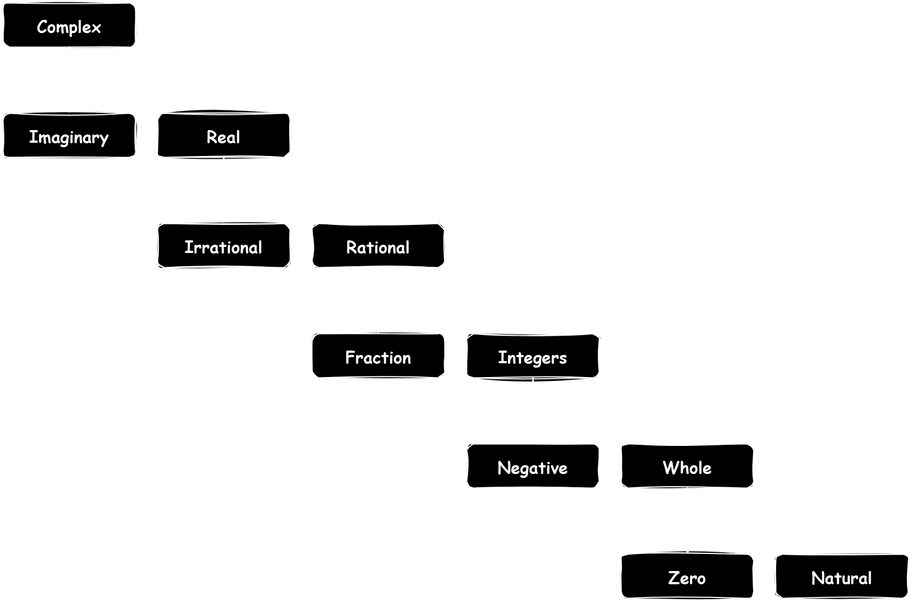

# Classification of Numbers (Number Systems)

## Introduction 
Let's think about our daily life, where counting our steps, checking the time, calculating your expenses or just simply measuring weight of our ingredients to cook our favourite meal. 
Have you ever wondered that human use different kinds of numbers for these tasks? 
Why are some numbers whole while others contain decimals point and what's the deal with numbers like $\sqrt{2}$ or some weird symbols that represent other numbers like $\pi$?
Understanding differences of numbers and how to classidied them are going to help us structure behind everything we will in mathematics. 
From the simplest tasks to solving the most complex calculus problem (*\*cough\* subtle foreshadowing*).

Number classification is the foundation of all mathematical concepts.
It help us organize and understand numerical systems, allow us to understand patterns, relationships and advanced theories.
Whether trying to solving equations, analyzing data, or programming algotihms, classification of number provide the essential framework.
In this topic, we'll learn the hierarchy of numbers, from natural numbers to complex numbers and understand their properties and relationships. 

## Types of Numbers

### Complex 
All numbers which can be expressed in the form $a+bi$ where $a$ and $b$ are real numnbers and $i=\sqrt{-1}$.
Each complex number is a combination of a real number ($\Re$ or $\mathbb{R}$) and an imaginary number $\Im$.

Symbols :
$$\mathbb{C}$$

Set Examples :

{$$1+2i,1,i,-3i,0,-5+i$$}

### Imaginary 
Numbers which are the product of a real number and the imaginary unit $i$ where $i=\sqrt{-1}$.

Symbols :
$$\Im$$ or {Im}

Set Examples :

{$$2i=\sqrt{-4},-5i=-\sqrt{-25}$$}
